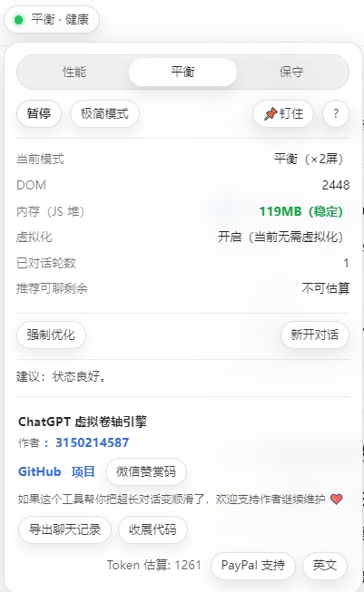
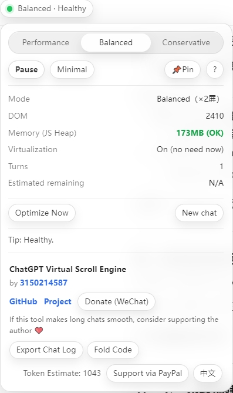

# 🚀 **Better ChatGPT Assistant（更好的ChatGPT:网页版多功能增强小助手）ChatGPT Virtual Scroll Engine🚀**  
### 🚀**Better ChatGPT Assistant（更好的ChatGPT:网页版多功能增强小助手）ChatGPT 网页长对话虚拟滚动引擎🚀
**小红书售卖sell link（30元，自从2025.10月一直没工作没存款，失业在家赚点泡面钱，谢谢大家）：**
**GPT性能优化/GPT卡顿优化/GPT长对话卡顿/GPT前端优化/**
40 【（6.0）失业在家的我写了GPT长对话优化工具 - 万能的momo | 小红书 - 你的生活兴趣社区】 😆 brL88kQftWmpDBZ 😆 https://www.xiaohongshu.com/discovery/item/69637564000000002202dfe5?source=webshare&xhsshare=pc_web&xsec_token=AB9lul4JtnDDDzI6IG1jhhhwNLFPQGf1If2GpEQbZAOQQ=&xsec_source=pc_share
https://www.xiaohongshu.com/user/profile/637cd41f000000001f014363
**Below is the bilingual introduction in Chinese and English:**  
**以下为中英文双语介绍：**

Better ChatGPT Assistant Fix ChatGPT web lag on long conversations using smart virtual scrolling.  
Better ChatGPT Assistant 使用智能虚拟滚动技术，解决 ChatGPT 网页版长对话卡顿问题。

  
  

---

# 🚀 **What is this? | 这是什么？**

When ChatGPT conversations become very long, the web page becomes slow, freezes, or crashes.  
This happens because **thousands of message DOM nodes stay in memory at the same time**.

当你在 ChatGPT 网页版中进行超长对话时，页面会越来越卡，甚至崩溃。  
这是因为 **成千上万条消息 DOM 节点被同时加载进内存**。

This project introduces a **Virtual Scroll Engine** for ChatGPT Web UI.  
It only keeps messages near your screen, and safely compresses everything else.

本项目为 ChatGPT 网页端提供了一套 **虚拟滚动引擎**：  
只保留当前屏幕附近的对话内容，远处的历史消息自动压缩，在需要时无损恢复。

**Result / 效果：**

- Smooth scrolling  
- Stable memory  
- Unlimited conversation length  

- 滚动流畅  
- 内存稳定  
- 可无限长对话  

---

# 🧠 **Key Features | 核心功能**

- Smart virtual scrolling for long conversations  
- Real-time DOM & memory monitor  
- Performance / Balanced / Conservative modes  
- iOS-style floating dashboard  
- No network, no tracking, no data upload  

- 智能虚拟滚动，解决长对话卡顿  
- 实时 DOM 与内存监控  
- 三种性能模式（性能 / 平衡 / 保守）  
- iOS 风格悬浮仪表盘  
- 本地运行，无联网、无追踪、无上传  
- ✨ Key Features｜核心功能
- 🚀 Long Chat Acceleration｜长对话加速（核心）
- Virtualize off-screen conversation turns to reduce DOM & memory pressure
- 屏幕外消息自动折叠占位，降低网页负载，长对话更顺滑
- Health status dot (Green / Yellow / Red)
- 顶栏健康灯：绿=健康，黄=偏高，红=接近卡顿
- 🧭 Compact Dashboard｜极简面板
- 3 modes: Performance / Balanced / Conservative
- 三段模式：性能 / 平衡 / 保守
- One-click “Optimize Now” (does NOT delete chat content)
- 一键“强制优化”（不删聊天内容，只是更激进折叠远处历史）
- Pin & drag the widget (optional)
- 支持钉住与拖拽定位
- 🧰 Productivity Tools｜效率工具
- Export chat to Markdown (UTF-8 BOM)
- 导出 Markdown（兼容中文 BOM）
- Fold/unfold code blocks
- 一键收展代码块
- Token estimate
- Token 粗略估算（按字符近似）
- 🌐 i18n｜中英切换
- Toggle UI language between 中文 / English
- 面板按钮中英切换
- 🧑‍💻 How to Use｜使用方法
- Install via Tampermonkey / Violentmonkey
- 用 Tampermonkey / Violentmonkey 安装脚本
- Open ChatGPT Web:
- 打开 ChatGPT 网页版：
- https://chatgpt.com/
- https://chat.openai.com/
- The small status dot / dashboard appears near the model switch button.
- 小圆点/面板会出现在“模型切换按钮”附近
- Tips｜小提示

- When using Ctrl+F, virtualization pauses automatically so browser search can find all history.
- 使用 Ctrl+F 搜索时会自动暂停虚拟化，确保能搜到全部历史，按 Esc 退出搜索后自动恢复。
- “Optimize Now” reduces page load immediately; chat content remains safe.
- “强制优化”会立刻变轻，不影响聊天内容本身。

---

# 🖥️ **Live Dashboard | 实时仪表盘**

A small floating indicator is shown near the ChatGPT model switch.  
在 ChatGPT 模型切换按钮旁边，会显示一个小状态指示器。

**Status Colors | 状态灯：**

- 🟢 Green = Healthy  
- 🟡 Yellow = Heavy  
- 🔴 Red = Danger  

- 🟢 绿色 = 状态良好  
- 🟡 黄色 = 负载偏高  
- 🔴 红色 = 内存危险  

**Click to view | 点击后可查看：**

- DOM node count（DOM 节点数）  
- JS heap memory（JS 内存）  
- Virtualized messages（已虚拟化消息数）  
- Conversation turns（对话轮数）  
- Recommended remaining turns（推荐剩余可聊轮数）  

---

# ⚙️ **Modes | 性能模式**

| Mode | Description | 说明 |
|------|-------------|------|
| **Performance** | Maximum memory saving | 最省内存，最激进虚拟化 |
| **Balanced** | Best for daily use | 推荐模式，平衡性能与可读性 |
| **Conservative** | Keeps more history | 保留更多历史，适合查旧内容 |

You can switch modes in real time using the iOS-style segmented control.  
你可以用 iOS 风格的滑动按钮随时切换模式。

---

# 📦 **Installation | 安装方法**
  方法1：
  购买后，按照里面教程安装
浏览器点击云盘链接安装油猴脚本，前提是你有油猴插件
 **Open ChatGPT | 打开**  
   https://chat.openai.com  
   or  
   https://chatgpt.com  

The dashboard will appear automatically.  
仪表盘会自动显示。

---

# 🔐 **Privacy & Security | 隐私与安全**

This script:

- Runs 100% locally  
- Sends no data anywhere  
- Does not record or upload conversations  

本脚本：

- 完全本地运行  
- 不向任何服务器发送数据  
- 不记录、不上传你的聊天内容  

Safe for personal and professional use.  
可安全用于学习、工作和私人对话。

---

# 📖 **How to Use | 使用教程**

### **1️⃣ After Installation | 安装完成后**
打开 ChatGPT 后，你会在模型切换按钮旁边看到一个小圆点（状态灯）。

### **2️⃣ Dot Colors | 小圆点含义**
🟢 正常 🟡 偏高 🔴 危险

### **3️⃣ Click to open panel | 点击打开面板**
查看 DOM、内存、对话轮数与推荐剩余。

### **4️⃣ Choose Mode | 选择模式**
性能 / 平衡 / 保守，可随时切换。

### **5️⃣ Pause or Enable | 暂停或启用**
暂停显示全部历史，启用则节省内存更流畅。

### **6️⃣ Red Warning | 红色怎么办**
点击 **强制清理** 立刻释放内存。

### **7️⃣ Ctrl + F**
搜索时自动恢复所有历史，搜索完自动继续加速。

### **8️⃣ Pin & Drag | 钉住拖动**
📌 可拖到屏幕边缘自动隐藏。

### **9️⃣ When to start new chat | 何时新开**
长期红色或黄色 → 备份 → 新对话。

---

# ❤️ **Support the Author | 支持作者**

If this tool helps you, you can support development by:

如果这个工具帮到了你，你可以通过以下方式支持作者：

- GitHub Star ⭐  
- Submitting issues or suggestions  
- Donation (WeChat / Alipay QR code in repo)  

## ☕ **Buy Me a Coffee | 微信赞赏**

If this project helps you, consider supporting the author ❤️  
如果这个项目帮到了你，欢迎支持作者喝杯咖啡 ❤️  
paypal：https://paypal.me/DKW3588

  

**Your support keeps this project alive and improving.**  
**你的支持将帮助这个项目持续维护与进化。**

Thank you for your kindness 🙏  
感谢你的善意  

---
